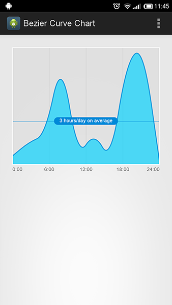
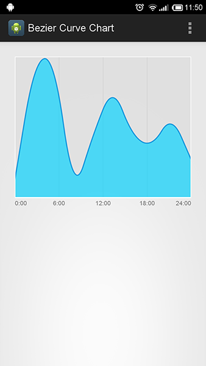
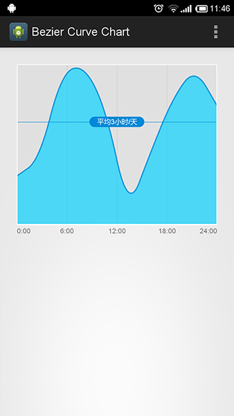

android-bezier-curve-chart
==========================

An Android Library which helps you build a smooth curve line
## English Version
### Screenshot

### how to
##### layout files
	 <com.cn.naive.lib.view.BezierCurveChart
        android:id="@+id/bezier_curve_chart"
        android:layout_width="match_parent"
        android:layout_height="260dp"
        android:layout_margin="10dp" />
        
##### Java code
	List<BezierCurveChart.Point> points=new ArrayList<BezierCurveChart.Point>();
	for(int i=0;i<10;i++) {
		points.add(new Point(i, (float) (Math.random()*10)));
	}
	String tipText = "3 hours/day on average";
			
	BezierCurveChart bezierCurveChart = 
		(BezierCurveChart) rootView.findViewById(R.id.bezier_curve_chart);
	bezierCurveChart.init(points, 
		new String[] { "0:00", "6:00", "12:00", "18:00", "24:00" }, tipText);
		
If you don't want to show the tips on the middle of the chart, set the last parameter of **bezierCurveChart.init** to null.

	bezierCurveChart.init(points, 
		new String[] { "0:00", "6:00", "12:00", "18:00", "24:00" }, null);
## 中文版

一个Android曲线绘制视图，利用贝塞尔曲线绘制平滑曲线

### 效果截图

### 使用说明
##### 布局文件
	 <com.cn.naive.lib.view.BezierCurveChart
        android:id="@+id/bezier_curve_chart"
        android:layout_width="match_parent"
        android:layout_height="260dp"
        android:layout_margin="10dp" />
        
##### Java代码
	List<BezierCurveChart.Point> points=new ArrayList<BezierCurveChart.Point>();
	for(int i=0;i<10;i++) {
		points.add(new Point(i, (float) (Math.random()*10)));
	}
	String tipText = "3 hours/day on average";		
	BezierCurveChart bezierCurveChart = 
		(BezierCurveChart) rootView.findViewById(R.id.bezier_curve_chart);
	bezierCurveChart.init(points, 
		new String[] { "0:00", "6:00", "12:00", "18:00", "24:00" }, tipText);
		
如果不需要中间的提示条，将**bezierCurveChart.init**最后一个参数设置为null即可，代码如下

	bezierCurveChart.init(points, 
		new String[] { "0:00", "6:00", "12:00", "18:00", "24:00" }, null);
		
